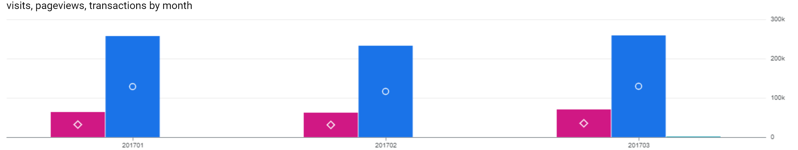

# SQL-Google-Ecommerce-Analytics-
This project is to analyze sales trends at a fictional company by examining important metrics such as total visits, bounce rate, revenue by traffic source, etc. The dataset is taken from BigQuery - google_analytics_sample.
What to expect in this project? 
  1. Total visit, pageview, transaction over time
  2. Bounce rate per traffic source over time
  3. Revenue by traffic source over time
  4. Average number of pageviews by purchaser type over time
  5. Average number of transactions per user that made a purchase over time
  6. Average amount of money spent per session
  7. Cohort map from product view to addtocart to purchase

# 1. Introduction and Motivation
This project focuses on analyzing sales trends at a fictional company by examining key performance metrics derived from the BigQuery google_analytics_sample dataset. The analysis covers various aspects of user behavior, including total visits, bounce rate, and revenue attributed to different traffic sources. By exploring these metrics, we aim to uncover patterns and insights that drive user engagement and sales performance.

The project highlights several key analyses:

Total visits, pageviews, and transactions over time
Bounce rate per traffic source over time
Revenue distribution by traffic source
Average number of pageviews by purchaser type over time
Average transactions per user that made a purchase
Average amount of money spent per session
A cohort analysis mapping the journey from product view to "add to cart" and eventual purchase
Through this analysis, we seek to provide actionable insights into customer behavior and sales trends, offering a comprehensive view of the company's performance across various traffic sources and user types.
     
# 2. Read and explain dataset
https://support.google.com/analytics/answer/3437719?hl=en

| Field Name                       | Data Type | Description                                                                                                                                                                                                                           |
|-----------------------------------|-----------|---------------------------------------------------------------------------------------------------------------------------------------------------------------------------------------------------------------------------------------|
| `fullVisitorId`                   | STRING    | The unique visitor ID.                                                                                                                                                                                                                |
| `date`                            | STRING    | The date of the session in YYYYMMDD format.                                                                                                                                                                                           |
| `totals`                          | RECORD    | This section contains aggregate values across the session.                                                                                                                                                                            |
| `totals.bounces`                  | INTEGER   | Total bounces (for convenience). For a bounced session, the value is 1, otherwise it is null.                                                                                                                                          |
| `totals.hits`                     | INTEGER   | Total number of hits within the session.                                                                                                                                                                                              |
| `totals.pageviews`                | INTEGER   | Total number of pageviews within the session.                                                                                                                                                                                          |
| `totals.visits`                   | INTEGER   | The number of sessions (for convenience). This value is 1 for sessions with interaction events. The value is null if there are no interaction events in the session.                                                                    |
| `trafficSource.source`            | STRING    | The source of the traffic source. Could be the name of the search engine, the referring hostname, or a value of the `utm_source` URL parameter.                                                                                         |
| `hits`                            | RECORD    | This row and nested fields are populated for any and all types of hits.                                                                                                                                                                |
| `hits.eCommerceAction`            | RECORD    | This section contains all of the ecommerce hits that occurred during the session. This is a repeated field and has an entry for each hit that was collected.                                                                            |
| `hits.eCommerceAction.action_type`| STRING    | The action type. <br> - Click through of product lists = 1 <br> - Product detail views = 2 <br> - Add product(s) to cart = 3 <br> - Remove product(s) from cart = 4 <br> - Check out = 5 <br> - Completed purchase = 6 <br> - Refund of purchase = 7 <br> - Checkout options = 8 <br> - Unknown = 0 <br> <br> Usually, this action type applies to all the products in a hit, except when `hits.product.isImpression = TRUE`. <br> **Example Queries:** <br>  - Calculate number of products in list views: <br> ``` SELECT COUNT(hits.product.v2ProductName) FROM [foo-160803:123456789.ga_sessions_20170101] WHERE hits.product.isImpression == TRUE ``` <br> - Calculate number of products in detailed view: <br> ``` SELECT COUNT(hits.product.v2ProductName) FROM [foo-160803:123456789.ga_sessions_20170101] WHERE hits.ecommerceaction.action_type = 2 AND ( BOOLEAN(hits.product.isImpression) IS NULL OR BOOLEAN(hits.product.isImpression) == FALSE) ```  |
| `hits.product`                    | RECORD    | This row and nested fields will be populated for each hit that contains Enhanced Ecommerce PRODUCT data.                                                                                                                                |
| `hits.product.productQuantity`    | INTEGER   | The quantity of the product purchased.                                                                                                                                                                                                |
| `hits.product.productRevenue`     | INTEGER   | The revenue of the product, expressed as the value passed to Analytics multiplied by 10^6 (e.g., 2.40 would be given as 2400000).                                                                                                       |
| `hits.product.productSKU`         | STRING    | Product SKU.                                                                                                                                                                                                                           |
| `hits.product.v2ProductName`      | STRING    | Product Name.                                                                                                                                                                                                                          |
# 3. Calculate total visit, pageview, transaction for Jan, Feb and March 2017 (order by month)
```
SELECT
  format_date("%Y%m", parse_date("%Y%m%d", date)) as month,
  SUM(totals.visits) AS visits,
  SUM(totals.pageviews) AS pageviews,
  SUM(totals.transactions) AS transactions,
FROM `bigquery-public-data.google_analytics_sample.ga_sessions_2017*`
WHERE _TABLE_SUFFIX BETWEEN '0101' AND '0331'
GROUP BY 1
ORDER BY 1;
```


## Sales Data by Month 
| Month  | Visits | Pageviews | Transactions |
|--------|--------|-----------|--------------|
| 201701 | 64694  | 257708    | 713          |
| 201702 | 62192  | 233373    | 733          |
| 201703 | 69931  | 259522    | 993          |


