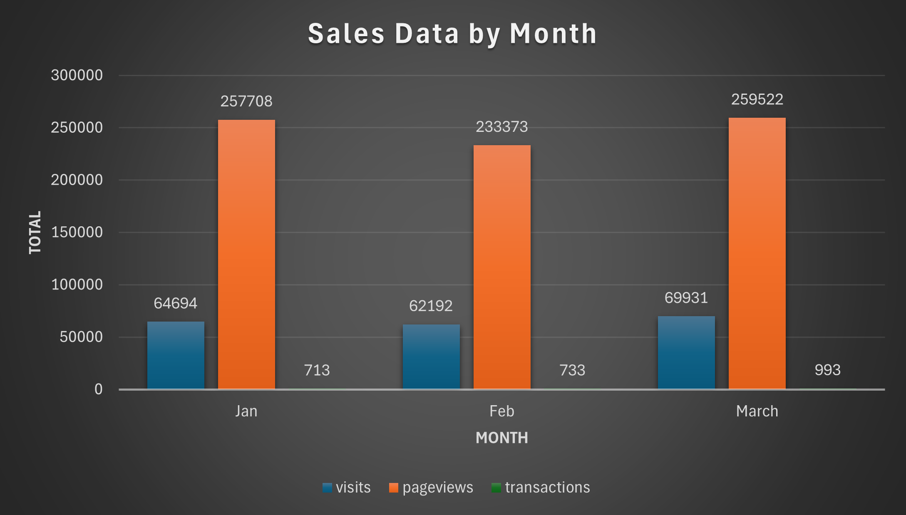

# SQL-Google-Ecommerce-Analytics-


# 1. Introduction and Motivation
This project focuses on analyzing sales trends at a fictional company by examining key performance metrics derived from the BigQuery google_analytics_sample dataset. The analysis covers various aspects of user behavior, including total visits, bounce rate, and revenue attributed to different traffic sources. By exploring these metrics, we aim to uncover patterns and insights that drive user engagement and sales performance.

The project highlights several key analyses:

  1. Total visit, pageview, transaction over time
  2. Bounce rate per traffic source over time
  3. Revenue by traffic source over time
  4. Average number of pageviews by purchaser type over time
  5. Average number of transactions per user that made a purchase over time
  6. Average amount of money spent per session
  7. Cohort map from product view to addtocart to purchase

     
# 2. Read and explain dataset
https://support.google.com/analytics/answer/3437719?hl=en

| Field Name                       | Data Type | Description                                                                                                                                                                                                                           |
|-----------------------------------|-----------|---------------------------------------------------------------------------------------------------------------------------------------------------------------------------------------------------------------------------------------|
| `fullVisitorId`                   | STRING    | The unique visitor ID.                                                                                                                                                                                                                |
| `date`                            | STRING    | The date of the session in YYYYMMDD format.                                                                                                                                                                                           |
| `totals`                          | RECORD    | This section contains aggregate values across the session.                                                                                                                                                                            |
| `totals.bounces`                  | INTEGER   | Total bounces (for convenience). For a bounced session, the value is 1, otherwise it is null.                                                                                                                                          |
| `totals.hits`                     | INTEGER   | Total number of hits within the session.                                                                                                                                                                                              |
| `totals.pageviews`                | INTEGER   | Total number of pageviews within the session.                                                                                                                                                                                          |
| `totals.visits`                   | INTEGER   | The number of sessions (for convenience). This value is 1 for sessions with interaction events. The value is null if there are no interaction events in the session.                                                                    |
| `trafficSource.source`            | STRING    | The source of the traffic source. Could be the name of the search engine, the referring hostname, or a value of the `utm_source` URL parameter.                                                                                         |
| `hits`                            | RECORD    | This row and nested fields are populated for any and all types of hits.                                                                                                                                                                |
| `hits.eCommerceAction`            | RECORD    | This section contains all of the ecommerce hits that occurred during the session. This is a repeated field and has an entry for each hit that was collected.                                                                            |
| `hits.eCommerceAction.action_type`| STRING    | The action type. <br> - Click through of product lists = 1 <br> - Product detail views = 2 <br> - Add product(s) to cart = 3 <br> - Remove product(s) from cart = 4 <br> - Check out = 5 <br> - Completed purchase = 6 <br> - Refund of purchase = 7 <br> - Checkout options = 8 <br> - Unknown = 0 <br> <br> Usually, this action type applies to all the products in a hit, except when `hits.product.isImpression = TRUE`. <br> **Example Queries:** <br>  - Calculate number of products in list views: <br> ``` SELECT COUNT(hits.product.v2ProductName) FROM [foo-160803:123456789.ga_sessions_20170101] WHERE hits.product.isImpression == TRUE ``` <br> - Calculate number of products in detailed view: <br> ``` SELECT COUNT(hits.product.v2ProductName) FROM [foo-160803:123456789.ga_sessions_20170101] WHERE hits.ecommerceaction.action_type = 2 AND ( BOOLEAN(hits.product.isImpression) IS NULL OR BOOLEAN(hits.product.isImpression) == FALSE) ```  |
| `hits.product`                    | RECORD    | This row and nested fields will be populated for each hit that contains Enhanced Ecommerce PRODUCT data.                                                                                                                                |
| `hits.product.productQuantity`    | INTEGER   | The quantity of the product purchased.                                                                                                                                                                                                |
| `hits.product.productRevenue`     | INTEGER   | The revenue of the product, expressed as the value passed to Analytics multiplied by 10^6 (e.g., 2.40 would be given as 2400000).                                                                                                       |
| `hits.product.productSKU`         | STRING    | Product SKU.                                                                                                                                                                                                                           |
| `hits.product.v2ProductName`      | STRING    | Product Name.                                                                                                                                                                                                                          |
# 3. Calculate total visit, pageview, transaction for Jan, Feb and March 2017 (order by month)
```
SELECT
  format_date("%Y%m", parse_date("%Y%m%d", date)) as month,
  SUM(totals.visits) AS visits,
  SUM(totals.pageviews) AS pageviews,
  SUM(totals.transactions) AS transactions,
FROM `bigquery-public-data.google_analytics_sample.ga_sessions_2017*`
WHERE _TABLE_SUFFIX BETWEEN '0101' AND '0331'
GROUP BY 1
ORDER BY 1;
```


## Sales Data by Month 
| Month  | Visits | Pageviews | Transactions |
|--------|--------|-----------|--------------|
| January | 64694  | 257708    | 713          |
| February | 62192  | 233373    | 733          |
| March | 69931  | 259522    | 993          |

Based on the result of the total visit, page view and transaction for the first 3 months in 2017, we oberve that:
- Visit trends: There was a decline in visits from January (64,694) to February (62,192) but an increase in March (69,931), indicating potential seasonal or promotional effects in March.
- Page View trends: Pageviews followed a similar trend as visits, with January having the highest (257,708) and February the lowest (233,373). However, March saw an increase in pageviews alongside the increase in visits, suggesting better engagement or content.
- Transactions: Transactions increased significantly from February (733) to March (993), which is a positive sign. This indicates that the increased visits and pageviews in March translated effectively into transactions.

We can also calculate the conversion rate by this formula: 100 * (transaction/visits) 
- January: conversion rate ~ 1.10%
- February: conversion rate ~ 1.18%
- March: conversion rate ~ 1.42%

Recommendations: 
1. Marketing Strategies
- The increase in March suggests that specific campaigns or promotions may have driven more traffic and conversions. We can analyze what have done well in March and replicate similar strategies in the upcoming months.

2. Optimize User Experience
- Given that pageviews are relatively high compared to visits, focus on improving the user journey on the site, we need to ensure that the website is intuitive and content is easily accessible to maintain engagement.

3. Encourage Repeat Visits
- To counter the drop in visits from January to February, we may implement strategies to encourage repeat visits, such as loyalty programs or personalized email marketing targeting users who visited but did not purchase.

4. A/B Testing
-  We might consider conducting A/B tests on landing pages and checkout processes to optimize conversion rates further. Small adjustments can significantly impact the overall transactions.


# 4. Bounce rate per traffic source in July 2017 (Bounce_rate = num_bounce/total_visit) (order by total_visit DESC)
```
SELECT trafficSource.source as source,  
       sum(totals.visits) as total_visits,
       sum(totals.bounces) as total_no_of_bounces,
       100.0 * sum(totals.bounces) / sum(totals.visits) as bounce_rate
FROM `bigquery-public-data.google_analytics_sample.ga_sessions_201707*`
GROUP BY source
ORDER BY total_visits DESC;
```
## Bounce rate per traffic source in July 2017
| Source                               | Total Visits | Total No of Bounces | Bounce Rate (%) |
|--------------------------------------|--------------|---------------------|-----------------|
| google                               | 38400        | 19798               | 51.56           |
| (direct)                             | 19891        | 8606                | 43.27           |
| youtube.com                          | 6351         | 4238                | 66.73           |
| analytics.google.com                 | 1972         | 1064                | 53.96           |
| Partners                             | 1788         | 936                 | 52.35           |
| m.facebook.com                       | 669          | 430                 | 64.28           |
| google.com                           | 368          | 183                 | 49.73           |
| dfa                                  | 302          | 124                 | 41.06           |
| sites.google.com                     | 230          | 97                  | 42.17           |
| facebook.com                         | 191          | 102                 | 53.40           |
| reddit.com                           | 189          | 54                  | 28.57           |
| qiita.com                            | 146          | 72                  | 49.32           |
| baidu                                | 140          | 84                  | 60.00           |
| quora.com                            | 140          | 70                  | 50.00           |
| bing                                 | 111          | 54                  | 48.65           |
| mail.google.com                      | 101          | 25                  | 24.75           |
| yahoo                                | 100          | 41                  | 41.00           |
| blog.golang.org                      | 65           | 19                  | 29.23           |
| l.facebook.com                       | 51           | 45                  | 88.24           |
| groups.google.com                    | 50           | 22                  | 44.00           |
| t.co                                 | 38           | 27                  | 71.05           |
| google.co.jp                         | 36           | 25                  | 69.44           |
| m.youtube.com                        | 34           | 22                  | 64.71           |
| dealspotr.com                        | 26           | 12                  | 46.15           |
| productforums.google.com             | 25           | 21                  | 84.00           |
| ask                                  | 24           | 16                  | 66.67           |
| support.google.com                   | 24           | 16                  | 66.67           |
| int.search.tb.ask.com                | 23           | 17                  | 73.91           |
| optimize.google.com                  | 21           | 10                  | 47.62           |
| docs.google.com                      | 20           | 8                   | 40.00           |
| lm.facebook.com                      | 18           | 9                   | 50.00           |
| l.messenger.com                      | 17           | 6                   | 35.29           |
| adwords.google.com                   | 16           | 7                   | 43.75           |
| duckduckgo.com                       | 16           | 14                  | 87.50           |
| google.co.uk                         | 15           | 7                   | 46.67           |
| sashihara.jp                         | 14           | 8                   | 57.14           |
| lunametrics.com                      | 13           | 8                   | 61.54           |
| search.mysearch.com                  | 12           | 11                  | 91.67           |
| outlook.live.com                     | 10           | 7                   | 70.00           |
| tw.search.yahoo.com                  | 10           | 8                   | 80.00           |
| phandroid.com                        | 9            | 7                   | 77.78           |
| connect.googleforwork.com            | 8            | 5                   | 62.50           |
| plus.google.com                      | 8            | 2                   | 25.00           |
| m.yz.sm.cn                           | 7            | 5                   | 71.43           |
| google.co.in                         | 6            | 3                   | 50.00           |
| search.xfinity.com                   | 6            | 6                   | 100.00          |
| google.ru                            | 5            | 1                   | 20.00           |
| online-metrics.com                   | 5            | 2                   | 40.00           |
| hangouts.google.com                  | 5            | 1                   | 20.00           |
| s0.2mdn.net                          | 5            | 3                   | 60.00           |
| m.sogou.com                          | 4            | 3                   | 75.00           |
| in.search.yahoo.com                  | 4            | 2                   | 50.00           |
| googleads.g.doubleclick.net          | 4            | 1                   | 25.00           |
| away.vk.com                          | 4            | 3                   | 75.00           |
| getpocket.com                        | 3            |                     |                 |
| m.baidu.com                          | 3            | 2                   | 66.67           |
| siliconvalley.about.com              | 3            | 2                   | 66.67           |
| google.it                            | 2            | 1                   | 50.00           |
| google.co.th                         | 2            | 1                   | 50.00           |
| wap.sogou.com                        | 2            | 2                   | 100.00          |
| msn.com                              | 2            | 1                   | 50.00           |
| calendar.google.com                  | 2            | 1                   | 50.00           |
| plus.url.google.com                  | 2            |                     |                 |
| github.com                           | 2            | 2                   | 100.00          |
| myactivity.google.com                | 2            | 1                   | 50.00           |
| centrum.cz                           | 2            | 2                   | 100.00          |
| uk.search.yahoo.com                  | 2            | 1                   | 50.00           |
| google.cl                            | 2            | 1                   | 50.00           |
| moodle.aurora.edu                    | 2            | 2                   | 100.00          |
| search.1and1.com                     | 2            | 2                   | 100.00          |
| au.search.yahoo.com                  | 2            | 2                   | 100.00          |
| m.sp.sm.cn                           | 2            | 2                   | 100.00          |
| amp.reddit.com                       | 2            | 1                   | 50.00           |
| google.nl                            | 1            |                     |                 |
| google.es                            | 1            | 1                   | 100.00          |
| gophergala.com                       | 1            | 1                   | 100.00          |
| malaysia.search.yahoo.com            | 1            | 1                   | 100.00          |
| kidrex.org                           | 1            | 1                   | 100.00          |
| earth.google.com                     | 1            |                     |                 |
| google.ca                            | 1            |                     |                 |
| aol                                  | 1            |                     |                 |
| newclasses.nyu.edu                   | 1            |                     |                 |
| kik.com                              | 1            | 1                   | 100.00          |
| web.facebook.com                     | 1            | 1                   | 100.00          |
| online.fullsail.edu                  | 1            | 1                   | 100.00          |
| mx.search.yahoo.com                  | 1            | 1                   | 100.00          |
| google.bg                            | 1            | 1                   | 100.00          |
| news.ycombinator.com                 | 1            | 1                   | 100.00          |
| it.pinterest.com                     | 1            | 1                   | 100.00          |
| search.tb.ask.com                    | 1            |                     |                 |
| images.google.com.au                 | 1            | 1                   | 100.00          |
| es.search.yahoo.com                  | 1            | 1                   | 100.00          |
| arstechnica.com                      | 1            |                     |                 |
| ph.search.yahoo.com                  | 1            |                     |                 |
| web.mail.comcast.net                 | 1            | 1                   | 100.00          |
| google.com.br                        | 1            |                     |                 |
| suche.t-online.de                    | 1            | 1                   | 100.00          |

# 5. Revenue by traffic source by week, by month in June 2017
To calculate revenue, use productRevenue

```
with get_data as
(select *, parse_date('%Y%m%d', date) as month
from `bigquery-public-data.google_analytics_sample.ga_sessions_201706*`
)

select 'month' as time_type,
        format_date('%Y%m', month) as time,
        trafficSource.source as source,
        sum(productRevenue / 1000000)  as revenue 
from get_data,
UNNEST (hits) hits,
UNNEST (hits.product) product
where productRevenue is not null   
group by time_type, time, source
UNION ALL 
select 'week' as time_type,
        format_date('%Y%W', month) as time,
        trafficSource.source as source,
        sum(productRevenue / 1000000)  as revenue 
from get_data,
UNNEST (hits) hits,
UNNEST (hits.product) product
where productRevenue is not null 
group by time_type, time, source;
```

| Time Type | Time  | Source              | Revenue  |
|-----------|-------|---------------------|----------|
| week      | 201726| google               | 5330.57  |
| week      | 201726| (direct)             | 14914.81 |
| week      | 201722| google               | 2119.39  |
| week      | 201722| sites.google.com     | 13.98    |
| week      | 201725| (direct)             | 27295.32 |
| week      | 201725| google               | 1006.10  |
| week      | 201723| dfa                  | 1145.28  |
| week      | 201724| bing                 | 13.98    |
| week      | 201724| dealspotr.com        | 72.95    |
| week      | 201726| groups.google.com    | 63.37    |
| week      | 201724| dfa                  | 2341.56  |
| week      | 201724| mail.google.com      | 2486.86  |
| week      | 201726| yahoo                | 20.39    |
| week      | 201724| l.facebook.com       | 12.48    |
| week      | 201725| sites.google.com     | 25.19    |
| week      | 201725| mail.aol.com         | 64.85    |
| week      | 201725| mail.google.com      | 76.27    |
| week      | 201725| groups.google.com    | 38.59    |
| week      | 201723| chat.google.com      | 74.03    |
| month     | 201706| dealspotr.com        | 72.95    |
| month     | 201706| yahoo                | 20.39    |
| month     | 201706| chat.google.com      | 74.03    |
| week      | 201726| dfa                  | 3704.74  |
| week      | 201722| (direct)             | 6888.90  |
| week      | 201722| dfa                  | 1670.65  |
| week      | 201723| (direct)             | 17325.68 |
| week      | 201724| (direct)             | 30908.91 |
| week      | 201724| google               | 9217.17  |
| week      | 201723| youtube.com          | 16.99    |
| week      | 201725| phandroid.com        | 52.95    |
| week      | 201725| google.com           | 23.99    |
| week      | 201723| google               | 1083.95  |
| week      | 201723| search.myway.com     | 105.94   |
| month     | 201706| google               | 18757.18 |
| month     | 201706| dfa                  | 8862.23  |
| month     | 201706| sites.google.com     | 39.17    |
| month     | 201706| youtube.com          | 16.99    |
| month     | 201706| phandroid.com        | 52.95    |
| month     | 201706| google.com           | 23.99    |
| month     | 201706| groups.google.com    | 101.96   |
| month     | 201706| (direct)             | 97333.62 |
| month     | 201706| bing                 | 13.98    |
| month     | 201706| mail.google.com      | 2563.13  |
| month     | 201706| l.facebook.com       | 12.48    |
| month     | 201706| mail.aol.com         | 64.85    |
| month     | 201706| search.myway.com     | 105.94   |


## 6. Average number of pageviews by purchaser type (purchasers vs non-purchasers) in June, July 2017
```
with purchaser_data as(
  select
      format_date("%Y%m",parse_date("%Y%m%d",date)) as month,
      (sum(totals.pageviews)/count(distinct fullvisitorid)) as avg_pageviews_purchase,
  from `bigquery-public-data.google_analytics_sample.ga_sessions_2017*`
    ,unnest(hits) hits
    ,unnest(product) product
  where _table_suffix between '0601' and '0731'
  and totals.transactions>=1
  and product.productRevenue is not null
  group by month
),

non_purchaser_data as(
  select
      format_date("%Y%m",parse_date("%Y%m%d",date)) as month,
      sum(totals.pageviews)/count(distinct fullvisitorid) as avg_pageviews_non_purchase,
  from `bigquery-public-data.google_analytics_sample.ga_sessions_2017*`
      ,unnest(hits) hits
    ,unnest(product) product
  where _table_suffix between '0601' and '0731'
  and totals.transactions is null
  and product.productRevenue is null
  group by month
)

select
    pd.*,
    avg_pageviews_non_purchase
from purchaser_data pd
left join non_purchaser_data using(month)
order by pd.month;
```
| Month | Avg Pageviews Purchase | Avg Pageviews Non-Purchase |
|-------|------------------------|----------------------------|
| June  | 94.02                  | 316.87                     |
| July  | 124.24                 | 334.06                     |


## 7. Average number of transactions per user that made a purchase in July 2017
```
select
    format_date("%Y%m",parse_date("%Y%m%d",date)) as month,
    sum(totals.transactions)/count(distinct fullvisitorid) as Avg_total_transactions_per_user
from `bigquery-public-data.google_analytics_sample.ga_sessions_201707*`
    ,unnest (hits) hits,
    unnest(product) product
where  totals.transactions>=1
and totals.totalTransactionRevenue is not null
and product.productRevenue is not null
group by month;
```
| Month   | Avg Total Transactions Per User |
|---------|-------------------------------|
| July  | 4.16                   |

## 8. Average amount of money spent per session. Only include purchaser data in July 2017
```
select
    format_date("%Y%m",parse_date("%Y%m%d",date)) as month,
    ((sum(product.productRevenue)/sum(totals.visits))/power(10,6)) as avg_revenue_by_user_per_visit
from `bigquery-public-data.google_analytics_sample.ga_sessions_201707*`
  ,unnest(hits) hits
  ,unnest(product) product
where product.productRevenue is not null
group by month;
```
| Month   | Avg Revenue by User Per Visit |
|---------|-------------------------------|
| July  | 43.85                  |


## 9. Other products purchased by customers who purchased product "YouTube Men's Vintage Henley" in July 2017. Output should show product name and the quantity was ordered.
```
select
    product.v2productname as other_purchased_product,
    sum(product.productQuantity) as quantity
from `bigquery-public-data.google_analytics_sample.ga_sessions_201707*`,
    unnest(hits) as hits,
    unnest(hits.product) as product
where fullvisitorid in (select distinct fullvisitorid
                        from `bigquery-public-data.google_analytics_sample.ga_sessions_201707*`,
                        unnest(hits) as hits,
                        unnest(hits.product) as product
                        where product.v2productname = "YouTube Men's Vintage Henley"
                        and product.productRevenue is not null)
and product.v2productname != "YouTube Men's Vintage Henley"
and product.productRevenue is not null
group by other_purchased_product
order by quantity desc;

with buyer_list as(
    SELECT
        distinct fullVisitorId
    FROM `bigquery-public-data.google_analytics_sample.ga_sessions_201707*`
    , UNNEST(hits) AS hits
    , UNNEST(hits.product) as product
    WHERE product.v2ProductName = "YouTube Men's Vintage Henley"
    AND totals.transactions>=1
    AND product.productRevenue is not null
)

SELECT
  product.v2ProductName AS other_purchased_products,
  SUM(product.productQuantity) AS quantity
FROM `bigquery-public-data.google_analytics_sample.ga_sessions_201707*`
, UNNEST(hits) AS hits
, UNNEST(hits.product) as product
JOIN buyer_list using(fullVisitorId)
WHERE product.v2ProductName != "YouTube Men's Vintage Henley"
 and product.productRevenue is not null
GROUP BY other_purchased_products
ORDER BY quantity DESC;
```
| Other Purchased Products                                     | Quantity |
|-------------------------------------------------------------|----------|
| Google Sunglasses                                           | 20       |
| Google Women's Vintage Hero Tee Black                       | 7        |
| SPF-15 Slim & Slender Lip Balm                              | 6        |
| Google Women's Short Sleeve Hero Tee Red Heather            | 4        |
| Google Men's Short Sleeve Badge Tee Charcoal                | 3        |
| YouTube Men's Fleece Hoodie Black                            | 3        |
| Red Shine 15 oz Mug                                        | 2        |
| Google Men's Short Sleeve Hero Tee Charcoal                 | 2        |
| YouTube Twill Cap                                          | 2        |
| 22 oz YouTube Bottle Infuser                               | 2        |
| Android Men's Vintage Henley                                | 2        |
| Google Doodle Decal                                        | 2        |
| Recycled Mouse Pad                                         | 2        |
| Android Women's Fleece Hoodie                               | 2        |
| Android Wool Heather Cap Heather/Black                      | 2        |
| Crunch Noise Dog Toy                                       | 2        |
| YouTube Custom Decals                                      | 1        |
| Google 5-Panel Cap                                         | 1        |
| Google Toddler Short Sleeve T-shirt Grey                   | 1        |
| Google Twill Cap                                           | 1        |
| Google Men's Performance Full Zip Jacket Black              | 1        |
| 26 oz Double Wall Insulated Bottle                         | 1        |
| Android Men's Vintage Tank                                  | 1        |
| Google Slim Utility Travel Bag                              | 1        |
| Google Men's Pullover Hoodie Grey                           | 1        |
| Google Men's Vintage Badge Tee White                        | 1        |
| YouTube Women's Short Sleeve Hero Tee Charcoal             | 1        |
| Google Men's 100% Cotton Short Sleeve Hero Tee Red         | 1        |
| Google Men's Zip Hoodie                                     | 1        |
| YouTube Men's Short Sleeve Hero Tee White                  | 1        |
| Android Men's Short Sleeve Hero Tee White                   | 1        |
| Android Men's Pep Rally Short Sleeve Tee Navy               | 1        |
| YouTube Men's Short Sleeve Hero Tee Black                   | 1        |
| Four Color Retractable Pen                                  | 1        |
| Google Laptop and Cell Phone Stickers                       | 1        |
| Google Men's Long & Lean Tee Charcoal                       | 1        |
| Google Men's Bike Short Sleeve Tee Charcoal                 | 1        |
| Android Sticker Sheet Ultra Removable                       | 1        |
| Google Men's Long Sleeve Raglan Ocean Blue                  | 1        |
| Google Men's Vintage Badge Tee Black                         | 1        |
| Google Men's Long & Lean Tee Grey                           | 1        |
| Google Women's Long Sleeve Tee Lavender                      | 1        |
| 8 pc Android Sticker Sheet                                   | 1        |
| YouTube Women's Short Sleeve Tri-blend Badge Tee Charcoal   | 1        |
| YouTube Hard Cover Journal                                   | 1        |
| Android BTTF Moonshot Graphic Tee                           | 1        |
| Google Men's Airflow 1/4 Zip Pullover Black                 | 1        |
| YouTube Men's Long & Lean Tee Charcoal                      | 1        |
| Google Men's Performance 1/4 Zip Pullover Heather/Black     | 1        |
| Android Men's Short Sleeve Hero Tee Heather                  | 1        |


## 10. Calculate cohort map from product view to addtocart to purchase in Jan, Feb and March 2017. 
```
with product_data as(
select
    format_date('%Y%m', parse_date('%Y%m%d',date)) as month,
    count(CASE WHEN eCommerceAction.action_type = '2' THEN product.v2ProductName END) as num_product_view,
    count(CASE WHEN eCommerceAction.action_type = '3' THEN product.v2ProductName END) as num_add_to_cart,
    count(CASE WHEN eCommerceAction.action_type = '6' and product.productRevenue is not null THEN product.v2ProductName END) as num_purchase
FROM `bigquery-public-data.google_analytics_sample.ga_sessions_*`
,UNNEST(hits) as hits
,UNNEST (hits.product) as product
where _table_suffix between '20170101' and '20170331'
and eCommerceAction.action_type in ('2','3','6')
group by month
order by month
)

select
    *,
    round(num_add_to_cart/num_product_view * 100, 2) as add_to_cart_rate,
    round(num_purchase/num_product_view * 100, 2) as purchase_rate
from product_data;
```
| Month  | Num Product View | Num Add to Cart | Num Purchase | Add to Cart Rate | Purchase Rate |
|--------|------------------|-----------------|--------------|------------------|---------------|
| Jan    | 25787            | 7342            | 2143         | 28.47%           | 8.31%         |
| Feb    | 21489            | 7360            | 2060         | 34.25%           | 9.59%         |
| Mar    | 23549            | 8782            | 2977         | 37.29%           | 12.64%        |


